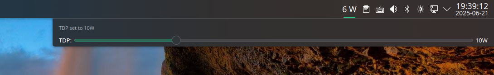
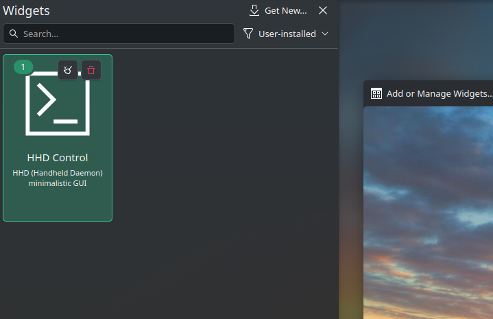

# HHD CPU Power Plasma Widget

A KDE Plasma widget that:

- Shows CPU package power consumption with `turbostat`
- Controls TDP with slider for [HHD (Handheld daemon)](https://github.com/hhd-dev/hhd)

## Prerequisites

- See supported devices on HHD page: https://github.com/hhd-dev/hhd?tab=readme-ov-file#supported-devices
- This is built on Archlinux + [KDE Plasma](https://wiki.archlinux.org/title/KDE) setup
  - [yay](https://github.com/Jguer/yay)
  - [dkms](https://wiki.archlinux.org/title/Dynamic_Kernel_Module_Support)

You need to set up HHD (Handheld Daemon) and related services first:

```bash
yay -S hhd hhd-ui adjustor apci_call-dkms
sudo systemctl enable hhd@$USER 
sudo systemctl enable power-profiles-daemon
systemctl --user enable plasma-powerdevil
reboot
```

After reboot, launch the `Handheld Daemon` desktop app:

- `Settings` ->
  - **disable** `energy management` and `PPD Emulation`, let's manage cpu governor with `power-profiles-daemon` & `powerdevil`.
  - enable `TDP controls`
- `General` -> disable `Hibernate when device asks and at 5%`

## Screenshots



## Building & Installation

```bash
git clone https://github.com/pastleo/hhd-tdp-ctl-plasma-widget.git
cd hhd-tdp-ctl-plasma-widget
./build.sh # and follow instruction to install

cd pkg-watt-stat
makepkg -si # and follow instruction to enable the service, this expose CPU package power for the widget
```

## Add the widget



### Uninstall 

After installation, you can manage the plasmoid using these commands:

```bash
# List installed plasmoids  
kpackagetool6 --type=Plasma/Applet --list

# Uninstall widget
kpackagetool6 --type=Plasma/Applet --remove org.kde.plasma.desktoptdpcontrol

# Uninstall pkg-watt-stat
yay -R pkg-watt-stat
```
