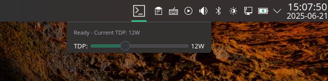
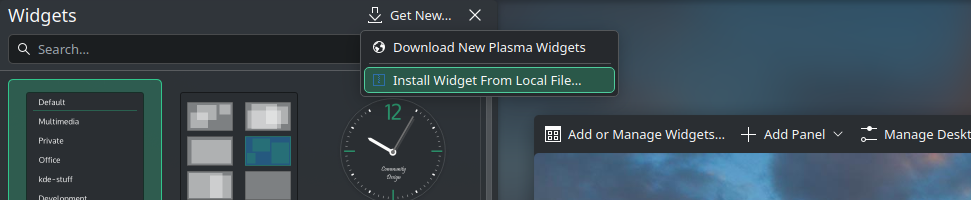

# HHD Control Plasmoid

A KDE Plasma widget that provides a minimalistic GUI for HHD (Handheld Daemon). This plasmoid allows you to manage TDP (Thermal Design Power) settings and other handheld device controls directly from your desktop.

The widget features:
- Simple TDP slider control
- Real-time TDP adjustment via HHD daemon
- Configurable preset shortcuts
- Compact design suitable for desktop panels or desktop placement

## Screenshots

### Widget in Action

*The HHD Control widget showing the TDP slider in the system panel*

### Installation Dialog

*Installing the widget through KDE's "Install Widget From Local File" dialog*

## Building

To build the plasmoid package for installation:

```bash
./build.sh
```

This will create a `.plasmoid` file that can be installed on any KDE Plasma desktop.

## Installation

### From Release
1. Download the `.plasmoid` file from releases
2. Install using: `kpackagetool6 --type=Plasma/Applet --install <filename>.plasmoid`

### From Source
1. Build the package: `./build.sh`
2. Install the generated `.plasmoid` file: `kpackagetool6 --type=Plasma/Applet --install org.kde.plasma.desktoptdpcontrol-*.plasmoid`

### Manual Installation (GUI)
1. Right-click on your desktop and select "Enter Edit Mode"
2. Click "Add or Manage Widgets" 
3. Click "Get New Widgets" at the bottom
4. Select "Install Widget From Local File..."
5. Browse and select the `.plasmoid` file
6. The widget will appear in your widget list as "HHD Control"

## Management Commands

After installation, you can manage the plasmoid using these commands:

```bash
# Upgrade to newer version
kpackagetool6 --type=Plasma/Applet --upgrade org.kde.plasma.desktoptdpcontrol-*.plasmoid

# Remove/uninstall
kpackagetool6 --type=Plasma/Applet --remove org.kde.plasma.desktoptdpcontrol

# List installed plasmoids  
kpackagetool6 --type=Plasma/Applet --list
```

## Configuration

The widget can be configured by right-clicking on it and selecting "Configure". You can customize TDP limits and other HHD daemon settings through the configuration panel.
